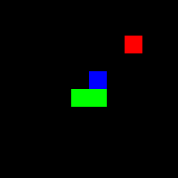
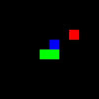
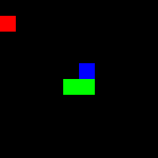
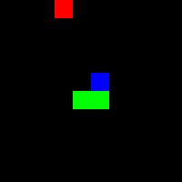
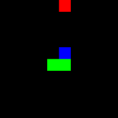

<div align="center">
  <h1>🐍 Snake AI avec Apprentissage par Renforcement 🧠</h1>
</div>

## 📚 Bibliothèques utilisées

- **Stable-Baselines3** : Implémentation des algorithmes d'apprentissage par renforcement (PPO)
- **Gymnasium** : Environnement standardisé pour l'entraînement d'agents IA
- **NumPy** : Manipulation efficace des données et calculs matriciels
- **Pygame** : Visualisation du jeu
- **OpenCV & Pillow** : Enregistrement des parties en format vidéo/GIF

## 🎮 Démonstration

### Évolution de l'apprentissage

<div align="center">
  <table>
    <tr>
      <td align="center"><b>Agent (150K steps)</b></td>
      <td align="center"><b>Agent (900K steps)</b></td>
      <td align="center"><b>Agent (9.75M steps)</b></td>
        <td align="center"><b>Agent (24M steps)</b></td>
      <td align="center"><b>Agent (45M steps)</b></td>
    </tr>
    <tr>
      <td></td>
      <td></td>
      <td></td>
            <td></td>
      <td></td>
    </tr>
  </table>
</div>

### Modèle final en action (66M steps)

<div align="center">
  
</div>

> Après 66 millions d'étapes d'entraînement, l'agent atteint une performance remarquable de 44.29 pommes en moyenne par partie, avec une durée moyenne de 471.85 steps. Le taux de timeout de 4% indique que l'agent devient si efficace qu'il atteint parfois la limite de temps sans collision.

## 💡 Système de récompenses

| Action | Récompense | Description |
|--------|------------|-------------|
| Manger une pomme | +50 | Objectif principal du jeu |
| Se rapprocher de la pomme | +0.1 | Encourager l'agent à rechercher la nourriture |
| S'éloigner de la pomme | -0.1 | Pénaliser l'éloignement |
| Revisiter une position | -0.1 | L'agent est pénalisé si la tête du serpent revient sur une case déjà visitée dans la partie actuelle. L'environnement garde une trace de toutes les positions visitées par la tête dans un ensemble (set) |
| Collision avec mur | -10 | Pénalité pour collision avec les bords de la grille |
| Collision avec corps | -10 | Pénalité quand le serpent se mord la queue |
| Timeout (300 steps sans manger) | -5 | Éviter les comportements passifs en limitant le temps entre deux pommes |
| Chaque action | -0.001 | Petite pénalité à chaque step pour encourager l'efficacité |

## 🔍 Canaux d'information (11 au total)

L'IA "voit" le jeu à travers 11 canaux d'information différents:

1. **Corps du serpent** : Position des segments du corps
2. **Tête du serpent** : Position de la tête
3. **Pomme** : Position de la nourriture
4. **Segment derrière la tête** : Position du premier segment du corps
5-8. **Direction actuelle** : Représentation one-hot de la direction (haut/bas/gauche/droite)
9. **Direction X vers la pomme** : Composante horizontale normalisée
10. **Direction Y vers la pomme** : Composante verticale normalisée
11. **Vecteur de danger** : Indique les directions dangereuses (murs ou collision)

## 📊 Performance des modèles

| Modèle (steps) | Pommes (moyenne) | Durée moyenne (steps) | Taux de timeout |
|----------------|------------------|------------------------|-----------------|
| 150,000        | 3.88             | 26.02                  | 0%              |
| 900,000        | 10.78            | 75.76                  | 0%              |
| 6,750,000      | 14.91            | 107.61                 | 0%              |
| 9,750,000      | 15.84            | 117.87                 | 0%              |
| 15,000,000     | 24.06            | 206.70                 | 0%              |
| 24,000,000     | 29.78            | 274.15                 | 0%              |
| 36,000,000     | 35.55            | 344.30                 | 0%              |
| 45,000,000     | 40.89            | 414.12                 | 0%              |
| 57,000,000     | 46.50            | 499.41                 | 2%              |
| **66,000,000** | **44.29**        | **471.85**             | **4%**          |


## 🚀 Installation

```bash
git clone https://github.com/votre-utilisateur/snake-v1.git
cd snake-v1
pip install -r [requirements.txt](http://_vscodecontentref_/0)
```

## 🎯 Commandes principales
Voici les principales commandes pour utiliser ce projet :

Jouer avec un modèle entraîné
``` bash
# Jouer avec le dernier modèle entraîné (sans paramètres)
python scripts/play_snake.py
# Enregistrer en GIF
python scripts/play_snake.py --model checkpoints_by_steps\model_66000000_steps --record

# Enregistrer en MP4
python scripts/play_snake.py --model checkpoints_by_steps\model_66000000_steps --record --format mp4
````
Évaluer les performances des modèles

``` bash
# Évaluer tous les modèles
python scripts/evaluate_models.py
```
Entraîner un nouveau modèle

``` bash
# Entraîner un modèle par défaut
python scripts/train_snake.py
```